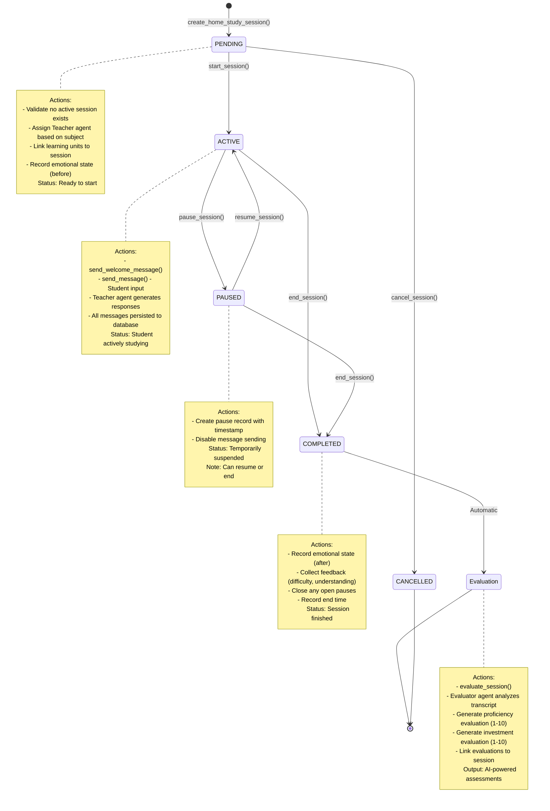
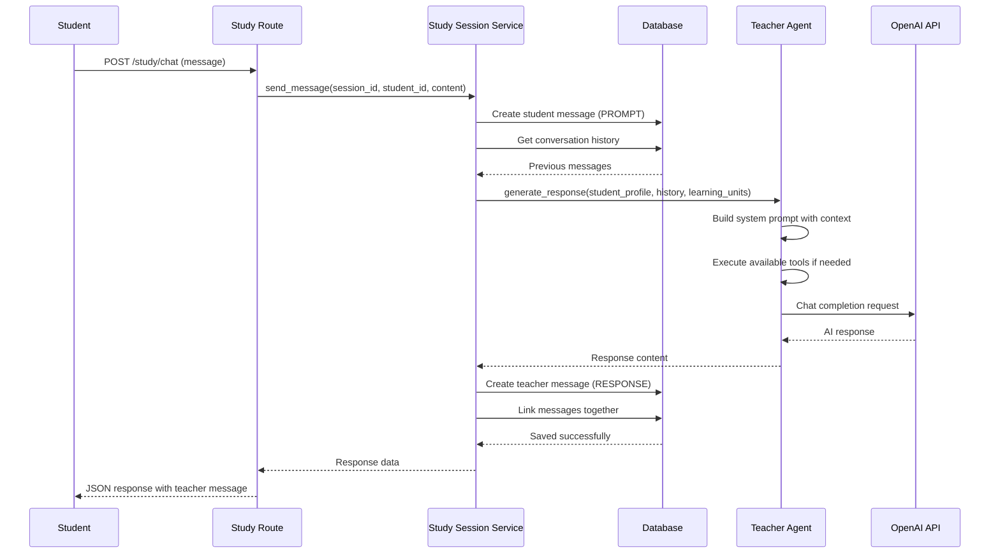
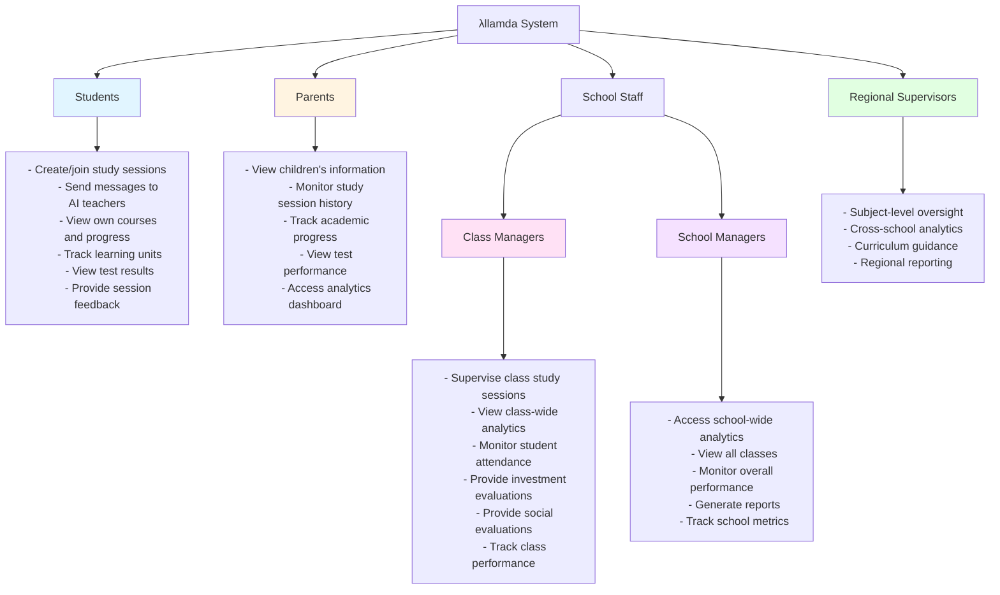
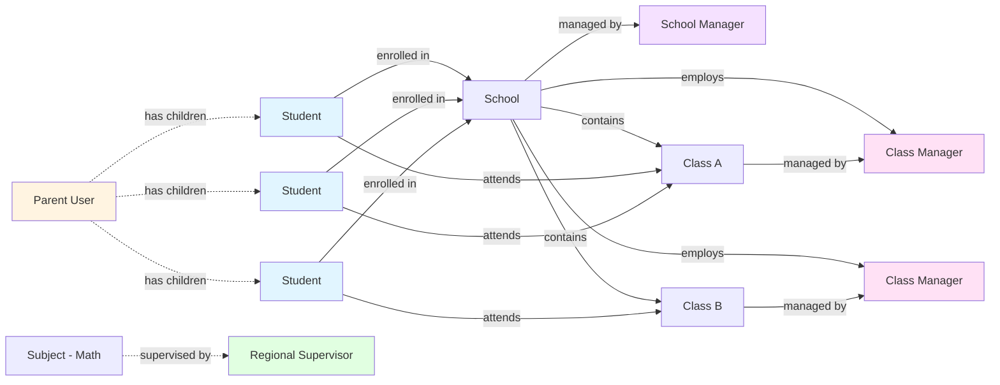
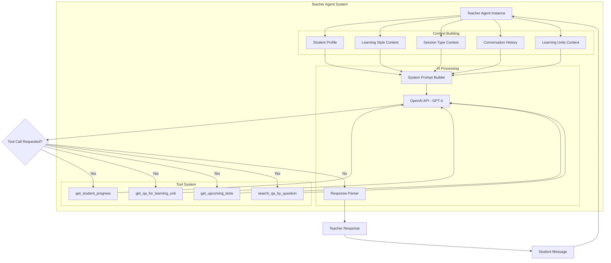
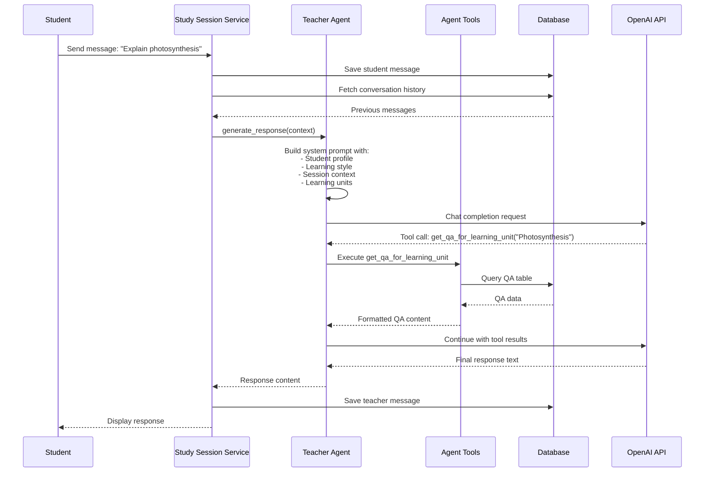
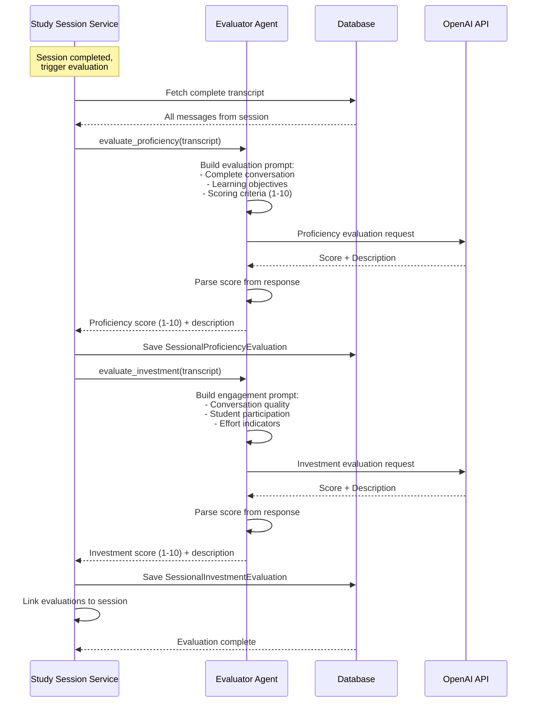
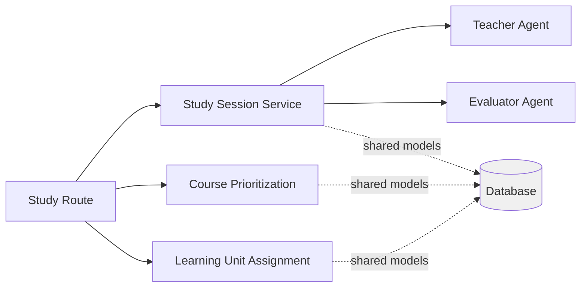

# λllamda Architecture Documentation

This document provides a comprehensive overview of the λllamda educational platform architecture, including system design, data models, user roles, and AI agent integration.

## Table of Contents

1. [System Architecture](#system-architecture)
2. [Study Session Lifecycle](#study-session-lifecycle)
3. [Database Schema](#database-schema)
4. [User Role Hierarchy](#user-role-hierarchy)
5. [AI Agent Integration](#ai-agent-integration)

---

## System Architecture

The λllamda platform follows a layered architecture pattern, separating concerns across presentation, business logic, data access, and external integrations.

```mermaid
graph TB
    subgraph "Client Layer"
        Browser[Web Browser]
        WebSocket[WebSocket Client]
    end
    
    subgraph "Presentation Layer - Flask App"
        direction TB
        AuthRoutes[Auth Routes]
        StudentRoutes[Student Routes]
        ParentRoutes[Parent Routes]
        ManagerRoutes[Manager Routes]
        StudyRoutes[Study Routes]
        WSHandler[WebSocket Handler]
        
        Templates[Jinja2 Templates]
        Static[Static Files - CSS/JS]
    end
    
    subgraph "Service Layer - Business Logic"
        direction TB
        StudySessionService[Study Session Service]
        PrioritizationService[Course Prioritization]
        LearningUnitService[Learning Unit Assignment]
        AnalyticsService[Analytics Service]
        VoiceService[Voice Mode Service]
    end
    
    subgraph "Model Layer"
        direction TB
        
        subgraph "AI Agents"
            TeacherAgent[Teacher Agent]
            EvaluatorAgent[Evaluator Agent]
            ToolSystem[Agent Tool System]
        end
        
        subgraph "Database Models"
            UserModels[User Models]
            SchoolModels[School Models]
            SubjectModels[Subject Models]
            SessionModels[Session Models]
            EvalModels[Evaluation Models]
            MessageModels[Message Models]
        end
    end
    
    subgraph "Data Access Layer"
        SessionContext[Session Context Manager]
        Decorators[Transaction Decorators]
        DatabaseManager[Database Manager]
    end
    
    subgraph "Infrastructure"
        MySQL[(MySQL Database)]
        FlaskSession[(Flask Session Store)]
        FileStorage[File Storage - Uploads]
    end
    
    subgraph "External Services"
        OpenAI[OpenAI API - GPT Models]
    end
    
    Browser --> AuthRoutes
    Browser --> StudentRoutes
    Browser --> ParentRoutes
    Browser --> ManagerRoutes
    Browser --> StudyRoutes
    WebSocket --> WSHandler
    
    AuthRoutes --> Templates
    StudentRoutes --> Templates
    ParentRoutes --> Templates
    ManagerRoutes --> Templates
    StudyRoutes --> Templates
    
    StudyRoutes --> StudySessionService
    StudyRoutes --> PrioritizationService
    StudyRoutes --> LearningUnitService
    StudentRoutes --> AnalyticsService
    WSHandler --> VoiceService
    
    StudySessionService --> TeacherAgent
    StudySessionService --> EvaluatorAgent
    StudySessionService --> SessionModels
    StudySessionService --> MessageModels
    
    PrioritizationService --> UserModels
    PrioritizationService --> SubjectModels
    
    LearningUnitService --> SubjectModels
    LearningUnitService --> SessionModels
    
    AnalyticsService --> EvalModels
    
    TeacherAgent --> ToolSystem
    TeacherAgent --> OpenAI
    EvaluatorAgent --> OpenAI
    
    UserModels --> SessionContext
    SchoolModels --> SessionContext
    SubjectModels --> SessionContext
    SessionModels --> SessionContext
    EvalModels --> SessionContext
    MessageModels --> SessionContext
    
    SessionContext --> DatabaseManager
    DatabaseManager --> MySQL
    
    Templates --> Static
    Templates --> Browser
    
    AuthRoutes -.-> FlaskSession
    StudyRoutes -.-> FileStorage
```



### Layer Responsibilities

#### Client Layer
- **Web Browser**: Primary interface for all user interactions
- **WebSocket Client**: Real-time communication for voice mode and live updates

#### Presentation Layer
- **Routes**: Handle HTTP requests, authentication, and route to appropriate services
  - `auth.py`: Login, logout, session management
  - `student.py`: Student dashboard, courses, progress
  - `parent.py`: Parent dashboard, children's progress
  - `class_manager.py`, `school_manager.py`: Management interfaces
  - `study/`: Study session creation, chat, lifecycle management
- **Templates**: Jinja2 templates for server-side rendering
- **Static Files**: CSS stylesheets and JavaScript for client-side interactivity

#### Service Layer
- **Study Session Service**: Complete study session lifecycle management
- **Course Prioritization**: Intelligent course ranking based on multiple factors
- **Learning Unit Assignment**: Automatic learning unit selection for sessions
- **Analytics Service**: Performance metrics and progress tracking
- **Voice Mode Service**: Speech-to-text and text-to-speech capabilities

#### Model Layer
- **AI Agents**: OpenAI-powered agents with tool usage capabilities
- **Database Models**: SQLAlchemy ORM models representing domain entities

#### Data Access Layer
- **Session Context Manager**: Thread-safe database session management
- **Transaction Decorators**: Automatic transaction handling and rollback
- **Database Manager**: Database initialization and schema management

---

## Study Session Lifecycle

The study session system uses a state machine pattern to manage the complete lifecycle from creation through completion, including AI interaction and evaluation.



### State Transition Functions

| Function | Current State | New State | Description |
|----------|--------------|-----------|-------------|
| `create_home_study_session()` | N/A | PENDING | Initialize new session with learning units |
| `start_session()` | PENDING | ACTIVE | Begin active study session |
| `pause_session()` | ACTIVE | PAUSED | Temporarily pause the session |
| `resume_session()` | PAUSED | ACTIVE | Resume paused session |
| `end_session()` | ACTIVE/PAUSED | COMPLETED | Complete session with feedback |
| `evaluate_session()` | COMPLETED | N/A | Generate AI evaluations (automatic) |

### Message Flow During Active Session



---

## Database Schema

The database follows a normalized relational design with clear entity relationships and inheritance hierarchies for users and sessions.

```mermaid
erDiagram
    User ||--o{ Student : "is a"
    User ||--o{ Parent : "is a"
    User ||--o{ ClassManager : "is a"
    User ||--o{ SchoolManager : "is a"
    User ||--o{ RegionalSupervisor : "is a"
    
    Parent }o--o{ Student : "parents_students"
    
    School ||--o{ Student : "enrolled in"
    School ||--o{ Class : "contains"
    School ||--|| SchoolManager : "managed by"
    School ||--o{ ClassManager : "employs"
    
    Class }o--o{ Student : "classes_students"
    Class }o--o{ ClassManager : "classess_class_managers"
    
    Subject ||--o{ Course : "contains"
    Subject ||--o{ Teacher : "assigned to"
    Subject }o--o{ RegionalSupervisor : "subjects_regional_supervisors"
    
    Course ||--o{ LearningUnit : "consists of"
    Course ||--o{ Test : "evaluates"
    Course }o--o{ Student : "courses_students"
    
    LearningUnit ||--o{ QA : "contains"
    LearningUnit }o--o{ Test : "tests_learning_units"
    
    Student ||--o{ TestStudent : "takes"
    Test ||--o{ TestStudent : "taken by"
    
    Student ||--o{ LearningUnitStudent : "progresses through"
    LearningUnit ||--o{ LearningUnitStudent : "progress"
    
    Student ||--o{ HomeHoursStudySession : "participates"
    Student ||--o{ SchoolHoursStudySession : "participates"
    
    HomeHoursStudySession ||--o{ Message : "contains"
    SchoolHoursStudySession ||--o{ Message : "contains"
    
    Student ||--o{ Message : "sends"
    Teacher ||--o{ Message : "responds"
    
    HomeHoursStudySession }o--o{ LearningUnit : "learning_units_home_sessions"
    SchoolHoursStudySession }o--o{ LearningUnit : "learning_units_school_sessions"
    
    Teacher ||--o{ HomeHoursStudySession : "teaches"
    Teacher ||--o{ SchoolHoursStudySession : "teaches"
    
    ClassManager ||--o{ SchoolHoursStudySession : "supervises"
    
    HomeHoursStudySession ||--o{ HomeHoursStudySessionPause : "pauses"
    SchoolHoursStudySession ||--o{ SchoolHoursStudySessionPause : "pauses"
    
    Student ||--o{ SessionalProficiencyEvaluation : "evaluated"
    Student ||--o{ SessionalInvestmentEvaluation : "evaluated"
    Student ||--o{ SessionalSocialEvaluation : "evaluated"
    
    Student ||--o{ QuarterProficiencyEvaluation : "evaluated"
    Student ||--o{ QuarterInvestmentEvaluation : "evaluated"
    Student ||--o{ QuarterSocialEvaluation : "evaluated"
    
    HomeHoursStudySession ||--o{ SessionalProficiencyEvaluation : "generates"
    HomeHoursStudySession ||--o{ SessionalInvestmentEvaluation : "generates"
    
    SchoolHoursStudySession }o--o{ SessionalSocialEvaluation : "generates"
    
    User {
        int id PK
        string username UK
        string email UK
        string password_hash
        string first_name
        string last_name
        date date_of_birth
        datetime created_at
    }
    
    Student {
        int id PK,FK
        int school_id FK
        enum learning_style
        enum routine_style
        enum collaboration_style
    }
    
    Course {
        int id PK
        string name
        enum grade_level
        enum type
        int level
        enum subject_name FK
    }
    
    LearningUnit {
        int course_id PK,FK
        string name PK
        enum type
        float weight
        int estimated_duration_minutes
        string previous_learning_unit
        string next_learning_unit
    }
    
    HomeHoursStudySession {
        int id PK
        enum type
        enum status
        datetime start_time
        datetime end_time
        int teacher_id FK
    }
    
    Message {
        int id PK
        int student_id FK
        int teacher_id FK
        int home_session_id FK
        int school_session_id FK
        enum message_type
        enum message_modality
        text content
        datetime timestamp
    }
    
    SessionalProficiencyEvaluation {
        int id PK
        int student_id FK
        int home_session_id FK
        int school_session_id FK
        int score
        text description
        datetime created_at
    }
    
    SessionalInvestmentEvaluation {
        int id PK
        int student_id FK
        int home_session_id FK
        int school_session_id FK
        int score
        text description
        datetime created_at
    }
```

### Key Entity Groups

#### User Entities
- **User**: Base user table with common attributes
- **Student**: Enrolled in courses, participates in sessions
- **Parent**: Views children's progress
- **ClassManager**: Manages class and supervises school sessions
- **SchoolManager**: Oversees entire school
- **RegionalSupervisor**: Subject-level oversight

#### Academic Entities
- **Subject**: Academic subject (Math, Science, etc.)
- **Course**: Specific course within a subject
- **LearningUnit**: Modular content unit within a course
- **QA**: Question-answer pairs for learning units
- **Test**: Assessments for courses

#### Session Entities
- **HomeHoursStudySession**: Student-initiated study sessions
- **SchoolHoursStudySession**: Class-based study sessions
- **Message**: Chat messages between students and AI teachers
- **StudySessionPause**: Pause records for sessions

#### Evaluation Entities
- **SessionalProficiencyEvaluation**: Per-session knowledge assessment
- **SessionalInvestmentEvaluation**: Per-session engagement assessment
- **SessionalSocialEvaluation**: Per-session social behavior (school only)
- **QuarterProficiencyEvaluation**: Quarterly knowledge assessment
- **QuarterInvestmentEvaluation**: Quarterly engagement assessment
- **QuarterSocialEvaluation**: Quarterly social behavior assessment

#### AI Agent Entities
- **Teacher**: AI teaching agents (GPT-based)
- **Evaluator**: AI evaluation models

---

## User Role Hierarchy

The platform supports multiple user types with different access levels and capabilities.



### User Relationships



### Permission Matrix

| Action | Student | Parent | Class Manager | School Manager | Regional Supervisor |
|--------|---------|--------|---------------|----------------|---------------------|
| Create study session | ✓ | ✗ | ✓ (school hours) | ✗ | ✗ |
| Chat with AI teacher | ✓ | ✗ | ✗ | ✗ | ✗ |
| View own progress | ✓ | ✗ | ✗ | ✗ | ✗ |
| View child progress | ✗ | ✓ | ✗ | ✗ | ✗ |
| View class analytics | ✗ | ✗ | ✓ | ✗ | ✗ |
| View school analytics | ✗ | ✗ | ✗ | ✓ | ✗ |
| View subject analytics | ✗ | ✗ | ✗ | ✗ | ✓ |
| Provide investment evaluation | ✗ | ✗ | ✓ | ✗ | ✗ |
| Provide social evaluation | ✗ | ✗ | ✓ | ✗ | ✗ |

---

## AI Agent Integration

The platform uses OpenAI's GPT models through specialized agent classes that provide educational support and assessment.

### Teacher Agent Architecture



### Agent Interaction Flow



### Evaluator Agent Flow



### Teacher Agent Tools

The Teacher agent has access to several tools to provide accurate, context-aware responses:

| Tool Name | Purpose | Database Query |
|-----------|---------|----------------|
| `get_student_progress` | Retrieve student's progress in current course | LearningUnitStudent table |
| `get_qa_for_learning_unit` | Get Q&A content for specific learning unit | QA table filtered by learning unit |
| `get_upcoming_tests` | Fetch upcoming tests for the course | Test, TestStudent tables |
| `search_qa_by_question` | Search Q&A by question text | QA table with text search |

### Agent Configuration

Both Teacher and Evaluator agents are configured with:

- **Model**: GPT-4 or GPT-3.5-turbo (configurable per subject)
- **Temperature**: 0.7 for Teacher (creative), 0.3 for Evaluator (consistent)
- **Max Tokens**: 1000 for responses
- **Subject Specialization**: Each teacher is assigned to a specific subject
- **Status**: Operational, Disabled, Deprecated, Development, or Testing

---

## Integration Patterns

### Service-to-Service Communication

Services communicate through well-defined interfaces and shared database models:



### Error Handling Strategy

The platform uses custom exceptions for domain-specific errors:

```python
# Study Session Service Exceptions
StudySessionError                  # Base exception
├── ActiveSessionExistsError       # Student has active session
├── SessionNotFoundError           # Session doesn't exist
└── InvalidSessionStateError       # Invalid state transition

# All exceptions propagate to routes for user-friendly error messages
```

### Transaction Management

Database transactions are managed using decorators and context managers:

```python
# Automatic transaction handling
@session_state_transition(expected_status, new_status)
def start_session(session, session_id, study_session):
    # Validation, state update, and commit handled by decorator
    pass

# Manual session context
from src.database.session_context import get_current_session
session = get_current_session()
# Session automatically committed or rolled back
```

---

## Technology Stack Details

### Backend Technologies
- **Flask 2.x**: Web framework
- **SQLAlchemy 2.x**: ORM for database access
- **Flask-Session**: Server-side session management
- **Python 3.9+**: Primary language

### Database
- **MySQL 8.x**: Primary data store
- **Alembic**: Database migrations (optional)

### AI/ML
- **OpenAI API**: GPT-4 and GPT-3.5-turbo
- **LangChain** (optional): Agent framework enhancements

### Frontend
- **Jinja2**: Server-side templating
- **Vanilla JavaScript**: Client-side interactivity
- **CSS3**: Styling
- **WebSocket**: Real-time communication (voice mode)

### Development Tools
- **Python Virtual Environment**: Dependency isolation
- **pip**: Package management
- **Git**: Version control

---

## Deployment Considerations

### Environment Variables
```bash
DB_USER=your_db_user
DB_PASSWORD=your_db_password
DB_HOST=localhost
DB_NAME=allamda
SECRET_KEY=your_secret_key
OPENAI_API_KEY=your_openai_key
```

### Database Initialization
```python
from src.database import DatabaseManager
DatabaseManager.create_tables()
DatabaseManager.populate_sample_data(clear_existing=True)
```

### Production Recommendations
- Use WSGI server (Gunicorn, uWSGI)
- Enable SSL/TLS for all connections
- Configure database connection pooling
- Set up proper logging and monitoring
- Implement rate limiting for OpenAI API calls
- Use environment-specific configuration
- Regular database backups
- Monitor API costs and usage

---

## Future Architecture Enhancements

### Planned Improvements
1. **Microservices Migration**: Split services into independent microservices
2. **Caching Layer**: Redis for session and frequently accessed data
3. **Message Queue**: RabbitMQ/Celery for async task processing
4. **GraphQL API**: Alternative to REST for flexible client queries
5. **Real-time Analytics**: WebSocket-based live dashboards
6. **Multi-tenant Support**: Separate databases per school/district
7. **Mobile Apps**: Native iOS/Android applications
8. **Advanced AI**: Fine-tuned models, embeddings for semantic search

### Scalability Considerations
- Horizontal scaling of Flask application servers
- Database read replicas for analytics queries
- CDN for static assets
- Load balancing across multiple instances
- Session store scaling (Redis Cluster)

---

## Contributing

When contributing to the architecture:
1. Follow the existing layered pattern
2. Keep business logic in service layer
3. Use decorators for cross-cutting concerns
4. Write unit tests for new services
5. Document API changes
6. Update this document for architectural changes

## Additional Resources

- [Study Session Service Documentation](src/services/study_session/README.md)
- [Course Prioritization Documentation](src/services/course_prioritization/README.md)
- [Learning Unit Assignment Documentation](src/services/learning_unit_assignment/README.md)
- [Main README](README.md)

---

**Last Updated**: November 2025  
**Version**: 1.0  
**Maintainers**: λllamda Development Team

