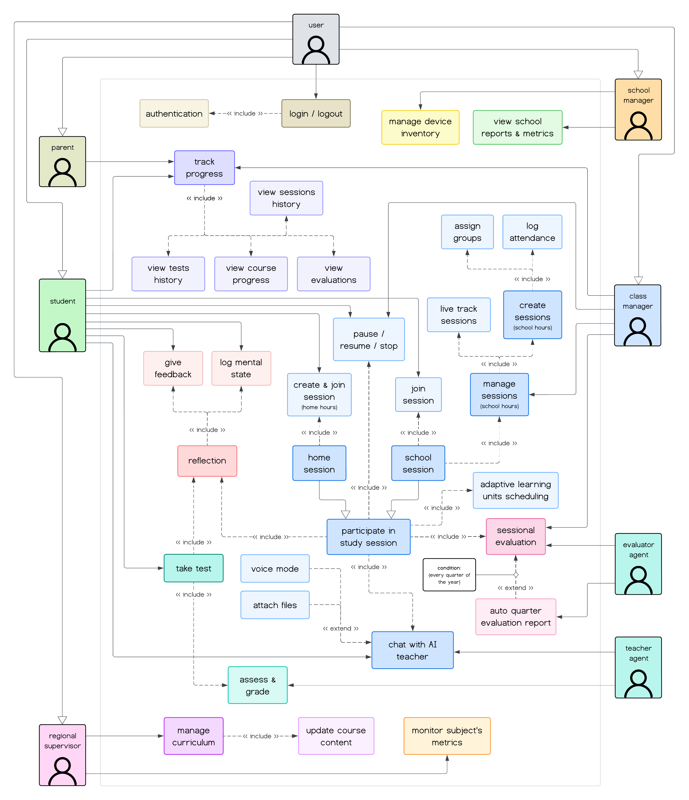
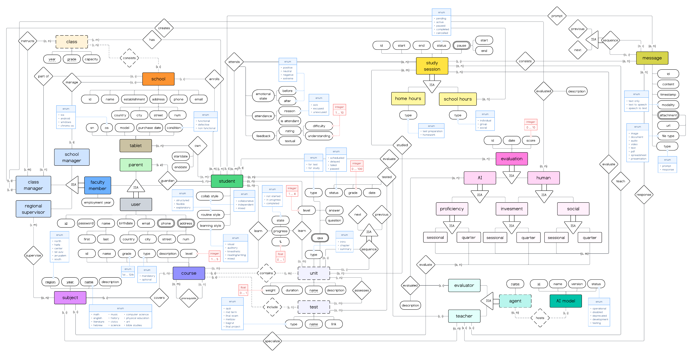

**An AI-Driven Educational Platform Exploring Adaptive, Personalized Learning**

---

## About This Project

Allamda is my exploration of how AI could transform education through personalized, adaptive learning. As a student passionate about both education and technology, I wanted to build something that demonstrates a different approach to teaching and learning in the AI era.

This project started from a question: *What if we could give every student a personal AI tutor that adapts to their learning style, and free up human teachers to focus on mentorship and facilitation?*

Traditional education often follows a one size fits all model. In Allamda, I've explored an inverted model where **AI Teacher Agents** provide personalized instruction tailored to each student's needs, while human **Class Managers** take on a supervisory role managing class dynamics and providing the human touch where it matters most.

The goal was to build a working proof of concept with real AI integration that can actually adapt to individual students.

---

## 🎥 See It In Action

Want to see how Allamda works? Check out the video showcase demonstrating the platform's key features and AI-powered study sessions:

**[▶️ Watch the Project Demo on LinkedIn](https://www.linkedin.com/posts/matan-halpert_newproject-agenticai-agenticlearning-activity-7394810548519059456-RE2u?utm_source=share&utm_medium=member_desktop&rcm=ACoAADNJQHIBvWg0eN_n-lMvScI3U0aw9eiAPiI)**

<i>The video walkthrough shows real interactions between students and AI Teacher Agents, the adaptive learning interface, and analytics dashboards.</i>

---

## Core Concepts

This project explores several key ideas for improving education through technology:

### 🎯 **Adaptive Learning**
The system adjusts lesson content and explanations based on each student's current level, learning pace, and comprehension style.

### 🤖 **AI Teacher Agents**
GPT-powered virtual instructors that provide subject-specific teaching 24/7, adapting based on conversation context and student learning profiles.

### 📊 **Data-Driven Insights**
Analytics track student progress and engagement, helping identify patterns and areas where students might need extra support.

### 🔄 **Intelligent Course Prioritization**
An algorithm that determines which subjects need attention by weighing factors like upcoming tests, current proficiency, performance trends, and student feedback.

### 👥 **Reimagined Teacher Role**
This explores how human teachers could focus on class management and mentorship while AI handles personalized instruction - improving the student-teacher ratio.

### 🧠 **Mental State Tracking**
Students record their emotional and cognitive states before and after sessions, providing data on when learning is most effective.

---

## What I Built

This repository contains a working **proof of concept** for the core functionality. While a full implementation would encompass entire schools and districts, I focused on building the **essential student-AI teacher interaction** through study sessions, along with the supporting infrastructure (+ Bonus analytics pages for some user roles).

### Implementation Highlights

✅ **AI-Powered Teaching Sessions**  
Chat-based study sessions where students interact with GPT-powered Teacher Agents that adapt based on learning style, conversation history, and current objectives.

✅ **Voice Interaction**  
Speech-to-text and text-to-speech capabilities for more natural, conversational learning.

✅ **Post-Session AI Evaluation**  
AI Evaluator Agents analyze complete session transcripts to assess student proficiency (knowledge retention) and investment (engagement level), generating 1-10 scores with detailed descriptions.

✅ **Course Prioritization Algorithm**  
A ranking system that determines which courses students should study next, weighing factors like upcoming test dates, current proficiency, performance trends, and student feedback.

✅ **Smart Learning Unit Assignment**  
Automatic content selection that chooses appropriate learning units based on student progress, session duration, and prerequisite dependencies.

✅ **Multi-Role User System**  
A complete role hierarchy (Students, Parents, Class Managers, School Managers, Regional Supervisors) with role-specific dashboards, permissions, and analytics.

✅ **Comprehensive Database Architecture**  
A normalized relational schema supporting educational entities, user relationships, session state management, conversation history, and evaluation tracking.

✅ **Service-Oriented Architecture**  
Clean separation of concerns: presentation layer (Flask routes/templates), service layer (business logic), model layer (AI agents + ORM), and data access layer.

---

## User Roles & Use Cases

The system supports multiple user roles, each with specific capabilities and workflows:

<a href="src/app/static/images/use_case_diagram.png" target="_blank">
  
</a>

<i>Click image to view full size</i>

---

## System Architecture

Allamda follows a **layered architecture** with clear separation of concerns:

```
┌─────────────────────────────────────────┐
│         Client Layer                    │
│    (Web Browser + WebSocket)            │
└─────────────────────────────────────────┘
                  ↓
┌─────────────────────────────────────────┐
│      Presentation Layer (Flask)         │
│  Routes | Templates | Static Assets     │
└─────────────────────────────────────────┘
                  ↓
┌─────────────────────────────────────────┐
│         Service Layer                   │
│  Study Sessions | Prioritization |      │
│  Unit Assignment | Analytics            │
└─────────────────────────────────────────┘
                  ↓
┌─────────────────────────────────────────┐
│          Model Layer                    │
│   AI Agents | Database Models           │
└─────────────────────────────────────────┘
                  ↓
┌─────────────────────────────────────────┐
│    Data Access & Infrastructure         │
│  MySQL | Session Store | File Storage   │
└─────────────────────────────────────────┘
```

### Database Schema Overview

The system uses a relational database design supporting all educational entities, user hierarchies, study sessions, and evaluations:

<a href="src/app/static/images/allamda_erd.png" target="_blank">
  
</a>

<i>Click image to view full size</i>

---

## Technology Stack

### Backend
- **Flask 2.x** - Web framework
- **SQLAlchemy 2.x** - ORM for database modeling
- **Python 3.9+** - Core language
- **Flask-Session** - Server-side session management
- **Flask-SocketIO** - WebSocket support for real-time features

### Database
- **MySQL 8.x** - Relational database supporting educational entities, sessions, evaluations, and user hierarchies

### AI Agentic System
- **OpenAI API** (GPT-4/3.5-turbo) - Powers Teacher and Evaluator agents
- **Custom Agent Framework** - Tool-equipped agents with database access

### Frontend
- **Jinja2** - Server-side templating
- **Vanilla JavaScript** - Client-side interactivity and WebSocket handling
- **CSS3** - Responsive styling
- **Plotly** - Interactive analytics visualizations

---

## Project Structure

```
λllamda/
├── src/
│   ├── app/                          # Flask application
│   │   ├── routes/                   # HTTP route handlers
│   │   │   ├── auth.py              # Authentication
│   │   │   ├── student.py           # Student dashboard & features
│   │   │   ├── parent.py            # Parent monitoring
│   │   │   ├── class_manager.py     # Class management
│   │   │   ├── school_manager.py    # School oversight
│   │   │   └── study/               # Study session routes
│   │   ├── templates/               # Jinja2 HTML templates
│   │   └── static/                  # CSS, JavaScript, images
│   │
│   ├── models/                       # Domain models
│   │   ├── agents/                  # AI agent implementations
│   │   │   ├── teacher/             # Teacher agent with tools
│   │   │   └── evaluator/           # Evaluator agent
│   │   ├── user_models.py           # User hierarchy
│   │   ├── school_models.py         # School, Class entities
│   │   ├── subject_models.py        # Subjects, Courses, Learning Units
│   │   ├── session_models.py        # Study sessions
│   │   └── evaluation_models.py     # AI-generated evaluations
│   │
│   ├── services/                     # Business logic layer
│   │   ├── study_session/           # Session lifecycle management
│   │   ├── course_prioritization/   # Course ranking
│   │   ├── learning_unit_assignment/# Content selection
│   │   ├── analytics/               # Progress tracking & reporting
│   │   └── voice_mode/              # Speech interaction
│   │
│   ├── database/                     # Database management
│   │   ├── setup.py                 # Schema creation
│   │   ├── session_context.py       # Thread-safe session handling
│   │   └── decorators.py            # Transaction management
│   │
│   └── utils/                        # Shared utilities
│       ├── logger.py                # Logging configuration
│       └── file_handler.py          # File operations
│
├── requirements.txt                  # Python dependencies
├── run.py                           # Application entry point
└── README.md                        # This file
```

---

## Getting Started

### Prerequisites
- Python 3.9 or higher
- MySQL 8.x
- OpenAI API key

### Installation

1. **Clone the repository**
   ```bash
   git clone <repository-url>
   cd allamda
   ```

2. **Create virtual environment**
   ```bash
   python -m venv venv
   source venv/bin/activate  # On Windows: venv\Scripts\activate
   ```

3. **Install dependencies**
   ```bash
   pip install -r requirements.txt
   ```

4. **Configure environment variables**
   
   Create a `.env` file in the project root:
   ```bash
   DB_USER=your_db_user
   DB_PASSWORD=your_db_password
   DB_HOST=localhost
   DB_NAME=allamda
   SECRET_KEY=your_flask_secret_key
   OPENAI_API_KEY=your_openai_api_key
   ```

5. **Initialize the database**
   ```python
   python run.py
   # In Python shell:
   from src.database import DatabaseManager
   DatabaseManager.create_tables()
   DatabaseManager.populate_sample_data(clear_existing=True)
   ```

6. **Run the application**
   ```bash
   python run.py
   ```
   
   The application will be available at `http://localhost:5000`

### Default Login Credentials (Sample Data)

After populating sample data, you can log in as:
- **Student**: Check the created sample users in the database
- **Parent**: Sample parent accounts with linked children
- **Class Manager**: Sample teachers managing classes
- **School Manager**: Sample administrators

---

## Potential Extensions

While this POC demonstrates the core concept, there are many directions it could grow:

### 🌍 **Scaling to District**
The architecture could support multi-school deployments with district-wide analytics and centralized curriculum (the database schema partially supports it).

### 📱 **Mobile Applications**
Native iOS/Android apps for learning on the go with offline mode and push notifications for study reminders.

### 🎮 **Gamification Elements**
Achievement systems, learning streaks, and progress-based rewards to increase motivation.

### 🧠 **Enhanced AI Models**
- Fine-tuning for specific subjects and grade levels
- Multimodal learning with image analysis and diagram generation
- Predictive analytics to identify students who might need extra support
- Better emotional intelligence to detect frustration or confusion

### 🤝 **Collaborative Learning**
Peer study sessions with AI moderation, group projects, and student-to-student knowledge sharing (infrastructure already supports it).

### 🌐 **Internationalization**
Multi-language support and cultural adaptation for global accessibility.

### 📊 **Advanced Analytics Dashboard**
Real-time visualizations, predictive modeling, and deeper insights for educators & regional supervisors.

---

## Technical Skills Demonstrated

This project is built on 4 main pillars:

### 1. 💻 Programming & Software Engineering
- **Python Development**: Flask web framework, object-oriented design, modular architecture

- **Software Architecture**: Layered architecture with clear separation of concerns (presentation, service, model, data access)
- **Algorithm Design**: Course prioritization logic, learning unit assignment algorithms

### 2. 🤖 AI Engineering
- **OpenAI API Integration**: GPT-4 and GPT-3.5-turbo for teaching and evaluation agents
- **Custom Agent Framework**: Tool-equipped agents with function calling capabilities
- **Structured Output**: JSON schema validation for consistent AI responses
- **Contextual AI**: Agents that adapt based on student profiles, conversation history, and real-time database access

### 3. 📊 Data Analysis & Business Intelligence
- **Analytics Dashboard**: Interactive visualizations using Plotly
- **Performance Metrics**: Tracking proficiency scores, engagement levels, and learning trends
- **Multi-Dimensional Analysis**: Student progress, course completion rates, test preparation insights
- **Data-Driven Decision Support**: Intelligent course prioritization based on multiple weighted factors

### 4. 🗄️ Information System Design
- **Database Architecture**: Comprehensive ERD with normalized relational schema (MySQL)
- **ORM Design**: SQLAlchemy models for users, schools, courses, sessions, evaluations
- **Multi-Role System**: Role-based access control with hierarchical permissions
- **State Management**: Session lifecycle handling, transaction management, thread-safe database access
- **Full-Stack Integration**: Flask routes, Jinja2 templates, responsive CSS, vanilla JavaScript

---

## What I Learned

Building Allamda taught me how these 4 pillars work together in a real system:

- **Programming**: How to structure a complex codebase with clean separation of concerns, manage state across multiple layers, and handle real-time interactions with WebSockets

- **AI Engineering**: Building agents that don't just chat, but actually use tools to query databases and adapt their teaching based on context. Understanding the difference between prompting and building a true agentic system

- **Data Analysis**: Translating raw educational data into actionable insights. Creating visualizations that actually help teachers and school managers understand student progress, not just display numbers

- **System Design**: Modeling an entire educational ecosystem with proper entity relationships, handling complex permission hierarchies, and designing schemas that scale beyond the initial use case

The biggest challenge was integrating all four pillars seamlessly: making AI agents that query a well-designed database, present insights through clean analytics, all while maintaining solid software engineering principles.

---

## License

See [LICENSE](LICENSE) file for details.

---

## Contact

If you have questions, suggestions, or want to discuss the project, feel free to reach out through the repository's issues or discussions.
